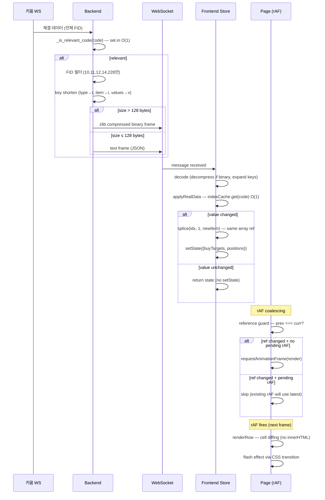

# Design Document: HTS 급 최적화 전수조사 및 수정계획

## Overview

SectorFlow 실시간 주식 자동매매 앱의 프론트엔드/백엔드 전체를 HTS(Home Trading System) 수준의 성능으로 최적화한다. 핵심 목표는 **초당 수백 회 틱 수신 환경에서 60fps UI 유지, 불필요한 DOM 조작 제거, O(1) 데이터 조회, 네트워크 대역폭 최소화**이다.

### 설계 원칙

1. **Reference Equality Guard**: 상태 참조가 변경되지 않으면 하위 로직을 실행하지 않는다
2. **rAF Coalescing**: 동일 프레임 내 다중 상태 변경을 단일 DOM 갱신으로 병합한다
3. **Incremental DOM Diffing**: innerHTML 파괴/재생성 대신 셀 단위 증분 갱신한다
4. **Index Cache**: 선형 탐색(O(n))을 Map 기반 O(1) 조회로 대체한다
5. **Delta-Only + Compression**: WS 메시지를 최소화하고 임계값 초과 시 압축한다

### 영향 범위

```
Frontend:
  stores/appStore.ts          — index cache, splice, reference guard
  pages/sell-position.ts      — rAF coalescing, reference guard
  pages/buy-target.ts         — rAF coalescing, reference guard
  pages/profit-overview.ts    — rAF coalescing, selective update
  pages/sector-stock.ts       — CSS display toggle (innerHTML 제거)
  components/common/data-table.ts  — cell diffing, flash effect
  components/common/fixed-table.ts — rowKey-based incremental update
  components/virtual-scroller.ts   — fixed-height fast path
  api/ws.ts                   — 재연결 시 스냅샷 새로고침, binary/text frame handling
  router.ts                   — module cache (프리페치 생략)

Backend:
  services/engine_account_notify.py — set cache for _is_relevant_code
  web/ws_manager.py                 — key shortening, FID filtering, zlib
```

## Architecture

### 시스템 아키텍처 (최적화 후)

```mermaid
graph TB
    subgraph Backend
        KW[키움 WS] --> ED[engine_ws_dispatch]
        ED --> EAN[engine_account_notify]
        EAN -->|_is_relevant_code<br/>set O(1) lookup| WSM[ws_manager]
        WSM -->|FID filter + key shorten<br/>+ zlib compress| WS_OUT[WebSocket Out]
    end

    subgraph Frontend
        WS_IN[WebSocket In] -->|binary: zlib decompress<br/>text: direct parse| DECODE[Message Decoder]
        DECODE -->|key expand| BIND[binding.ts]
        BIND --> STORE[appStore]
        
        STORE -->|splice + index cache| APPLY[applyRealData]
        APPLY -->|reference unchanged → skip| GUARD[Reference Guard]
        
        GUARD -->|ref changed| RAF[rAF Coalescer]
        RAF -->|1 call/frame| RENDER[Page Render]
        
        RENDER --> DT[DataTable<br/>cell diffing]
        RENDER --> FT[FixedTable<br/>rowKey diffing]
        RENDER --> VS[VirtualScroller<br/>fixed-height fast path]
        
        DT -->|price changed| FLASH[CSS Flash]
    end

    subgraph Reconnection
        WS_IN -->|reconnect| BACKFILL[Backfill Manager]
        BACKFILL -->|buffer events| BUF[Event Buffer]
        BACKFILL -->|timeout 5s| REST[REST /api/snapshot]
        BACKFILL -->|snapshot received| STORE
        BUF -->|replay in order| STORE
    end
```

### 데이터 흐름 (최적화 후 단일 틱 처리)



## Components and Interfaces

### 1. rAF Coalescer (공통 패턴)

각 페이지(sell-position, buy-target, profit-overview)에 적용되는 공통 갱신 병합 패턴:

```typescript
// 공통 rAF coalescing 패턴 (각 페이지에 인라인 적용)
interface RafCoalescer {
  // 상태: 이전 참조 + rAF 핸들
  prevRef: unknown
  rafHandle: number | null
  
  // 구독 콜백에서 호출
  scheduleUpdate(currentRef: unknown): void
  
  // unmount 시 호출
  cancel(): void
}

// 의사코드
function createRafCoalescer<T>(
  getRef: (state: AppState) => T,
  onRender: (latest: T) => void,
): { schedule: (state: AppState) => void; cancel: () => void } {
  let prevRef: T | null = null
  let rafHandle: number | null = null

  function schedule(state: AppState): void {
    const current = getRef(state)
    if (current === prevRef) return  // reference equality guard
    prevRef = current
    if (rafHandle !== null) return   // already scheduled
    rafHandle = requestAnimationFrame(() => {
      rafHandle = null
      onRender(current)
    })
  }

  function cancel(): void {
    if (rafHandle !== null) {
      cancelAnimationFrame(rafHandle)
      rafHandle = null
    }
  }

  return { schedule, cancel }
}
```

### 2. AppStore Index Cache

```typescript
// appStore.ts 내부 추가
interface IndexCaches {
  buyTargetIndex: Map<string, number>   // code → array index
  positionIndex: Map<string, number>    // stk_cd → array index
}

// 캐시 재구축 함수
function rebuildBuyTargetIndex(targets: BuyTarget[]): Map<string, number> {
  const map = new Map<string, number>()
  for (let i = 0; i < targets.length; i++) {
    map.set(targets[i].code, i)
  }
  return map
}

function rebuildPositionIndex(positions: Position[]): Map<string, number> {
  const map = new Map<string, number>()
  for (let i = 0; i < positions.length; i++) {
    map.set(positions[i].stk_cd, i)
  }
  return map
}
```

### 3. DataTable Cell Diffing (renderRow 최적화)

```typescript
// data-table.ts renderRow 대체
function renderRowDiff(row: TableRow<T>, index: number, rowEl: HTMLElement): void {
  const isFirst = rowEl.childElementCount === 0
  
  if (isFirst || isGroupRow(row) !== wasGroupRow(rowEl)) {
    // 최초 렌더링 또는 행 타입 변경 → 전체 생성
    rowEl.innerHTML = ''
    // ... 기존 로직으로 셀 생성
    return
  }

  if (isGroupRow(row)) {
    // 그룹 행 — 단일 셀 textContent 갱신
    const cell = rowEl.firstElementChild as HTMLElement
    // ... 그룹 행 갱신
    return
  }

  // 데이터 행 — 셀별 diff
  const dataRow = row as T
  const cells = rowEl.children
  for (let i = 0; i < columns.length; i++) {
    const cell = cells[i] as HTMLElement
    const content = columns[i].render(dataRow, index)
    
    if (typeof content === 'string') {
      if (cell.textContent !== content) {
        cell.textContent = content
      }
    } else if (content instanceof HTMLElement) {
      // HTMLElement 비교: outerHTML 기반
      const existing = cell.firstElementChild as HTMLElement | null
      if (!existing || existing.outerHTML !== content.outerHTML) {
        cell.innerHTML = ''
        cell.appendChild(content)
      }
    }
  }
}
```

### 4. FixedTable Incremental Update

```typescript
// fixed-table.ts updateRows 대체
interface FixedTableOptions<T> {
  // 기존 필드 + 추가
  rowKey: (row: T, idx: number) => string  // 필수화
}

function updateRowsIncremental(newRows: TableRow<T>[]): void {
  if (tbody.childElementCount === 0) {
    // 초기 로딩 — 기존 일괄 렌더링
    for (const row of newRows) tbody.appendChild(renderDataRow(row, idx))
    return
  }

  // rowKey 기반 diff
  const oldKeyMap = new Map<string, HTMLElement>()  // key → tr element
  // ... 기존 행 매핑 구축
  
  const newKeySet = new Set<string>()
  for (const row of newRows) {
    const key = rowKey(row, idx)
    newKeySet.add(key)
    const existingTr = oldKeyMap.get(key)
    if (existingTr) {
      // 셀별 diff 갱신
      diffCells(existingTr, row, idx)
    } else {
      // 신규 행 삽입
      tbody.appendChild(renderDataRow(row, idx))
    }
  }
  
  // 제거된 행 DOM 삭제
  for (const [key, tr] of oldKeyMap) {
    if (!newKeySet.has(key)) tr.remove()
  }
}
```

### 5. Virtual Scroller Fixed-Height Fast Path

```typescript
// virtual-scroller.ts 추가
interface FixedHeightMode {
  enabled: boolean
  rowHeight: number  // 모든 행이 동일한 높이
}

// 고정 높이 감지 (초기화 시)
function detectFixedHeight(items: T[], getRowHeight: (item: T, idx: number) => number): FixedHeightMode {
  if (items.length === 0) return { enabled: false, rowHeight: 0 }
  const h0 = getRowHeight(items[0], 0)
  for (let i = 1; i < Math.min(items.length, 10); i++) {
    if (getRowHeight(items[i], i) !== h0) return { enabled: false, rowHeight: 0 }
  }
  return { enabled: true, rowHeight: h0 }
}

// 고정 높이 모드에서의 오프셋 계산
function getOffsetFixed(index: number, rowHeight: number): number {
  return index * rowHeight
}

function getTotalHeightFixed(count: number, rowHeight: number): number {
  return count * rowHeight
}
```

### 6. WS 재연결 시 스냅샷 새로고침 (간소화)

```typescript
// ws.ts 내부 — 재연결 시 간소화된 흐름
// 버퍼링/replay 없음 — 시간 순서 꼬임 위험 제거

// 재연결 후 흐름:
// 1. reconnect 성공 → 장중 실시간 데이터 필드 비움 (기존 방식 유지)
// 2. 서버로부터 initial-snapshot 수신 → AppStore 전체 교체 (applyInitialSnapshot)
// 3. 정상 실시간 수신 모드 전환
// 4. backfilling 플래그로 UI에 동기화 상태 표시

// 결정 근거: 버퍼링+replay 방식은 시간 순서 꼬임 위험이 있어
// 기존 방식(장중 데이터 비움 + 스냅샷 새로고침)이 데이터 정합성 측면에서 안전함
```

### 7. WS Message Encoder/Decoder

```typescript
// Backend (Python): ws_manager.py
// 인코딩: FID 필터 → key shorten → JSON → size check → compress if > 512

// Frontend: ws.ts
// 디코딩: binary? → zlib decompress → JSON parse → key expand

const KEY_MAP = { t: 'type', i: 'item', v: 'values' } as const
const KEY_MAP_REV = { type: 't', item: 'i', values: 'v' } as const
const ALLOWED_FIDS = new Set(['10', '11', '12', '14', '228'])
```

### 8. Backend Set Cache (_is_relevant_code)

```python
# engine_account_notify.py 또는 engine_service.py
# 기존: any(... for p in _positions) — O(n)
# 변경: _positions_code_set: set[str] — O(1)

_positions_code_set: set[str] = set()
_layout_code_set: set[str] = set()

def _rebuild_positions_cache(positions: list[dict]) -> None:
    global _positions_code_set
    _positions_code_set = {
        _format_kiwoom_reg_stk_cd(str(p.get("stk_cd", "")))
        for p in positions
    }

def _rebuild_layout_cache(layout: list[tuple]) -> None:
    global _layout_code_set
    _layout_code_set = {v for t, v in layout if t == "code"}

def _is_relevant_code(nk: str) -> bool:
    return (
        nk in _pending_stock_details
        or nk in _positions_code_set
        or nk in _layout_code_set
    )
```

### 9. Price Flash Effect

```typescript
// data-table.ts 내부 — CSS transition 기반 플래시
// 구현: 셀에 data-prev-price 속성 저장, 가격 변경 시 배경색 즉시 적용 후 transition으로 fade

const FLASH_DURATION = '300ms'
const FLASH_UP_COLOR = 'rgba(255, 59, 48, 0.15)'    // 빨간색 (상승)
const FLASH_DOWN_COLOR = 'rgba(0, 122, 255, 0.15)'  // 파란색 (하락)

// CSS (글로벌 스타일시트에 추가)
// .cell-flash { transition: background-color 300ms ease-out; }

function applyFlash(cell: HTMLElement, direction: 'up' | 'down'): void {
  // reflow 강제로 transition 재시작
  cell.style.transition = 'none'
  cell.style.backgroundColor = direction === 'up' ? FLASH_UP_COLOR : FLASH_DOWN_COLOR
  cell.offsetHeight  // force reflow
  cell.style.transition = `background-color ${FLASH_DURATION} ease-out`
  cell.style.backgroundColor = 'transparent'
}
```

### 10. Router Module Cache (프리페치 생략)

```typescript
// router.ts 수정
// moduleCache 활성화 (주석 해제)
// 프리페치 미구현 — 장중 체결 틱 부하 시 requestIdleCallback이 거의 실행되지 않아 이득 없음

async function loadModule(config: RouteConfig): Promise<PageModule> {
  const cached = moduleCache.get(config.path)
  if (cached) return cached
  const mod = await config.load()
  moduleCache.set(config.path, mod)
  return mod
}

// prefetchIdleRoutes 생략 — 장중 부하 방지, 복잡도 대비 이득 미미
// 결정 근거: 장중에는 체결 틱이 많아 idle 콜백이 거의 실행되지 않거나 오히려 부하만 추가
```

### 11. Page-Aware Data Filtering (보고 있는 화면만 데이터 받기)

```python
# ws_manager.py 확장

class WSManager:
    def __init__(self) -> None:
        self._clients: set[WebSocket] = set()
        self._client_active_page: dict[WebSocket, str] = {}  # per-client active page
        # ...

    def set_active_page(self, ws: WebSocket, page: str) -> None:
        """클라이언트의 활성 페이지 설정."""
        self._client_active_page[ws] = page

    def clear_active_page(self, ws: WebSocket) -> None:
        """클라이언트의 활성 페이지 해제."""
        self._client_active_page.pop(ws, None)

    def unregister(self, ws: WebSocket) -> None:
        self._clients.discard(ws)
        self._client_active_page.pop(ws, None)  # 연결 해제 시 정리

    def _is_code_relevant_for_page(self, page: str, code: str) -> bool:
        """페이지별 종목 코드 관련성 판별."""
        import app.services.engine_service as _es
        if page == "sector-analysis":
            # 업종별종목시세 테이블용: layout 종목만
            return any(v == code for t, v in _es._sector_stock_layout if t == "code")
        elif page == "buy-target":
            # 매수후보 종목만
            return code in {bt.stock.code for bt in (_es._sector_summary_cache.buy_targets if _es._sector_summary_cache else [])}
        elif page == "sell-position":
            # 보유종목만
            from app.services.engine_symbol_utils import _format_kiwoom_reg_stk_cd
            return any(_format_kiwoom_reg_stk_cd(str(p.get("stk_cd", ""))) == code for p in _es._positions)
        elif page in ("profit-overview", "settings", "buy-settings", "sell-settings", "general-settings", "sector-custom"):
            return False  # real-data 전송 안 함
        return True  # 알 수 없는 페이지 → 전송 (안전 폴백)

    async def _send_realdata_filtered(self, text: str, code: str) -> None:
        """per-client 필터링 적용 real-data 전송."""
        dead: set[WebSocket] = set()
        for ws in set(self._clients):
            page = self._client_active_page.get(ws)
            if page and not self._is_code_relevant_for_page(page, code):
                continue  # 이 클라이언트에는 전송 생략
            try:
                await ws.send_text(text)
            except Exception:
                dead.add(ws)
        for ws in dead:
            self.unregister(ws)
```

```typescript
// 프론트엔드: 각 페이지 mount/unmount 시 WS 메시지 전송
// router 또는 각 페이지 모듈에서 호출

function notifyPageActive(page: string): void {
  wsClient.send(JSON.stringify({ event: 'page-active', data: { page } }))
}

function notifyPageInactive(page: string): void {
  wsClient.send(JSON.stringify({ event: 'page-inactive', data: { page } }))
}

// 페이지별 식별자 매핑:
// '#/sector-analysis' → 'sector-analysis'
// '#/buy-target'      → 'buy-target' (buy-settings 포함)
// '#/sell-position'   → 'sell-position' (sell-settings 포함)
// '#/profit-overview' → 'profit-overview'
// '#/general-settings', '#/sector-custom' → 'settings'
```

## Data Models

### AppState 확장 (Index Cache)

```typescript
interface AppState {
  // 기존 필드 유지
  sectorStocks: Record<string, SectorStock>
  buyTargets: BuyTarget[]
  positions: Position[]
  // ...

  // 신규: 인덱스 캐시 (Zustand state 외부 — 파생 데이터)
  // 주의: 이 캐시는 state 내부가 아닌 모듈 스코프 변수로 관리
}

// 모듈 스코프 (appStore.ts 상단)
let _buyTargetIndexCache: Map<string, number> = new Map()
let _positionIndexCache: Map<string, number> = new Map()
```

### BackfillState (WSClient 내부)

```typescript
interface BackfillState {
  buffering: boolean
  eventBuffer: Array<{ event: string; data: unknown; timestamp: number }>
  snapshotTimeoutId: ReturnType<typeof setTimeout> | null
  restRetryCount: number
}
```

### WS Message Format (최적화 후)

```typescript
// 기존 (text frame)
{ "event": "real-data", "data": { "type": "01", "item": "005930", "values": { "10": "72000", "11": "1000", "12": "1.41", "14": "15000", "228": "120.5", "15": "...", "16": "..." } } }

// 최적화 후 (text frame, ≤128 bytes)
{ "event": "real-data", "data": { "t": "01", "i": "005930", "v": { "10": "72000", "11": "1000", "12": "1.41", "14": "15000", "228": "120.5" } } }

// 최적화 후 (binary frame, >128 bytes) — zlib compressed version of above
```

### Flash State (DataTable 내부)

```typescript
// 행별 이전 가격 추적 (가상 스크롤러 renderRow 내부)
// key → { prevPrice: number, flashTimestamp: number }
const flashState = new Map<string, { prevPrice: number; flashTs: number }>()
```


## Correctness Properties

*A property is a characteristic or behavior that should hold true across all valid executions of a system — essentially, a formal statement about what the system should do. Properties serve as the bridge between human-readable specifications and machine-verifiable correctness guarantees.*

### Property 1: Reference Equality Guard (상태 참조 미변경 시 갱신 생략)

*For any* sequence of store state changes where the monitored field reference (positions, buyTargets, etc.) remains identical (`===`), the page's DOM update logic (updateRows, sort, etc.) SHALL NOT be invoked.

**Validates: Requirements 1.1, 1.2, 2.2, 12.1, 12.3**

### Property 2: rAF Coalescing (프레임 내 다중 변경 → 단일 갱신)

*For any* number N (N ≥ 1) of store state changes occurring within a single animation frame (~16ms), the page SHALL invoke its DOM update function exactly 1 time with the latest state, regardless of N.

**Validates: Requirements 1.3, 1.4, 2.1, 11.1**

### Property 3: Index Cache Consistency (인덱스 캐시 정합성)

*For any* buyTargets array state, the buyTargetIndexCache Map SHALL satisfy: for every element `targets[i]`, `cache.get(targets[i].code) === i`, and `cache.size === targets.length`. The same invariant applies to positionIndexCache with `positions[i].stk_cd`.

**Validates: Requirements 4.1, 4.2, 4.3, 4.4, 4.5**

### Property 4: Splice + Derived Field Recalculation (증분 갱신 정확성)

*For any* position with `buy_amt > 0`, `qty > 0`, and a new `cur_price`, after splice update: `eval_amount === cur_price × qty`, `pnl_amount === eval_amount − buy_amt`, and `pnl_rate === round((pnl_amount / buy_amt) × 100, 2)`.

**Validates: Requirements 5.1, 5.2**

### Property 5: applyRealData No-Op Guard (변경 없으면 상태 유지)

*For any* real-data tick where the target code does not exist in buyTargets/positions, or where all compared fields (cur_price, change, change_rate, strength, trade_amount) are identical to existing values, applyRealData SHALL return the existing state object without calling Zustand setState.

**Validates: Requirements 5.3, 12.3**

### Property 6: Cell Diffing Idempotence (동일 데이터 재렌더링 시 DOM 무변경)

*For any* row data T and its corresponding rendered row element, calling renderRow with the same data a second time SHALL produce zero DOM mutations (no textContent writes, no appendChild, no removeChild).

**Validates: Requirements 3.1, 3.2**

### Property 7: FixedTable Incremental Update (rowKey 기반 증분 갱신)

*For any* two consecutive row arrays `oldRows` and `newRows`, after updateRows(newRows): (a) rows with keys in newRows but not oldRows have new DOM nodes inserted, (b) rows with keys in oldRows but not newRows have their DOM nodes removed, (c) rows with keys in both have only changed cells updated.

**Validates: Requirements 7.1, 7.2, 7.3**

### Property 8: _is_relevant_code Set Equivalence (set 캐시 정확성)

*For any* stock code `nk` and any state of `_positions` and `_sector_stock_layout`, the set-based `_is_relevant_code(nk)` SHALL return the same boolean result as the original list-traversal implementation.

**Validates: Requirements 9.1, 9.2, 9.3, 9.4, 9.5**

### Property 9: Virtual Scroller Fixed-Height Offset (고정 높이 오프셋 산술)

*For any* item count N and fixed row height H, the computed offset for index i SHALL equal `i × H`, and totalHeight SHALL equal `N × H`. Additionally, for any height change at index k in variable-height mode, offsets[j] for j < k SHALL remain unchanged.

**Validates: Requirements 10.1, 10.3, 10.5**

### Property 10: Selective Page Update (선택적 DOM 갱신)

*For any* store state change in profit-overview where only one field group changes (positions/account OR sellHistory/buyHistory OR dailySummary), only the corresponding DOM section SHALL be updated, and other sections SHALL receive zero DOM mutations.

**Validates: Requirements 11.2, 11.3, 11.4**

### Property 11: WS Message Round-Trip (인코딩/디코딩 왕복)

*For any* valid real-data message with fields {type, item, values}, encoding (FID filter → key shorten → optional zlib compress) followed by decoding (optional zlib decompress → key expand) SHALL produce a message semantically equivalent to the original (with only allowed FIDs retained).

**Validates: Requirements 14.2, 14.5**

### Property 12: WS Compression Threshold (압축 임계값)

*For any* serialized real-data JSON message, if byte length > 128 then the output SHALL be a zlib-compressed binary frame; if byte length ≤ 128 then the output SHALL be an uncompressed text frame.

**Validates: Requirements 14.3, 14.4**

### Property 13: WS FID Filtering (불필요 필드 제거)

*For any* real-data message with arbitrary FID keys in values, the transmitted message SHALL contain only FIDs in the set {10, 11, 12, 14, 228}, and any FID not present in the original SHALL be omitted (not set to null).

**Validates: Requirements 14.1**

### Property 14: Flash Direction Matches Price Change (플래시 방향 정확성)

*For any* price change from `prevPrice` to `newPrice` where `prevPrice ≠ newPrice`: if `newPrice > prevPrice` then the flash color SHALL be red (up); if `newPrice < prevPrice` then the flash color SHALL be blue (down). For rapid successive changes within 300ms, the final visible flash SHALL match the direction of the last change.

**Validates: Requirements 13.1, 13.2, 13.3, 13.5**

### Property 15: WS Backfill Event Buffering (백필 중 이벤트 버퍼링)

*For any* sequence of real-data and delta events received during the backfill state (between reconnection and snapshot application), none SHALL be applied to the AppStore until the snapshot is applied, and then they SHALL be replayed in their original reception order.

**Validates: Requirements 8.2, 8.3**

### Property 16: Sector-Stock Title CSS Toggle (innerHTML 미사용)

*For any* sequence of updateUI calls with varying sectorStatus/minTradeAmt/stockCount values, the title area DOM element count SHALL remain constant (no createElement, no removeChild after initial mount), and only textContent and style.display properties SHALL change.

**Validates: Requirements 6.1, 6.2, 6.3, 6.4**

## Error Handling

### Frontend

| 상황 | 처리 방식 |
|------|-----------|
| renderRow 내 개별 셀 render 예외 | try-catch로 해당 셀만 건너뛰고 기존 DOM 유지, 나머지 셀 계속 처리 |
| WS 메시지 zlib 해제 실패 | console.error 후 해당 메시지 무시, 연결 유지 |
| WS 메시지 JSON 파싱 실패 | console.error 후 해당 메시지 무시, 연결 유지 |
| REST 백필 요청 실패 (4xx/5xx) | 3000ms 후 1회 재시도, 재시도 실패 시 WS 재연결 |
| REST 백필 네트워크 오류 | 동일 — 3000ms 후 1회 재시도 |
| initial-snapshot 5000ms 타임아웃 | REST fallback으로 전환 |
| indexCache 불일치 감지 | 전체 캐시 재구축 (defensive rebuild) |
| rAF 콜백 실행 시 이미 unmount | mounted 플래그 확인 후 즉시 return |
| VirtualScroller 오프셋 drift (>1px) | 전체 재계산 fallback |

### Backend

| 상황 | 처리 방식 |
|------|-----------|
| zlib 압축 실패 | 압축 없이 텍스트 프레임으로 전송 (graceful degradation) |
| _is_relevant_code 내 캐시 set 미초기화 | 빈 set으로 처리 (False 반환 → 메시지 미전송) |
| WS send 실패 (클라이언트 disconnect) | 해당 클라이언트만 unregister, 나머지 계속 |
| _positions 재할당 중 캐시 재구축 예외 | 이전 캐시 유지 + 로그 경고 |

## Testing Strategy

### Property-Based Testing (PBT)

**라이브러리 선택:**
- Frontend: [fast-check](https://github.com/dubzzz/fast-check) (TypeScript)
- Backend: [Hypothesis](https://hypothesis.readthedocs.io/) (Python)

**설정:**
- 최소 100 iterations per property
- 각 테스트에 `// Feature: hts-level-optimization, Property N: {title}` 태그

**PBT 대상 (Properties 1-16):**

| Property | 테스트 대상 함수/모듈 | Generator |
|----------|----------------------|-----------|
| 1 | rAF coalescer schedule() | arbitrary state sequences with ref preservation |
| 2 | rAF coalescer (mock rAF) | random N (1-100) state changes |
| 3 | rebuildBuyTargetIndex / rebuildPositionIndex | random BuyTarget[]/Position[] arrays |
| 4 | applyRealData (splice + recalc) | random Position with buy_amt, qty, new price |
| 5 | applyRealData (no-op path) | random ticks with non-existent codes or same values |
| 6 | renderRowDiff (cell diffing) | random row data pairs (same key, same/different values) |
| 7 | updateRowsIncremental | random old/new row arrays with overlapping keys |
| 8 | _is_relevant_code (Python) | random codes + random positions/layout states |
| 9 | computeOffsets / fixed-height path | random item counts and heights |
| 10 | profit-overview selective update | random field-group changes |
| 11 | encode/decode round-trip | random real-data messages |
| 12 | compression threshold logic | random message sizes (50-500 bytes) |
| 13 | FID filter function | random values dicts with arbitrary FID keys |
| 14 | applyFlash direction logic | random price change sequences |
| 15 | backfill buffer + replay | random event sequences during backfill |
| 16 | sector-stock updateUI | random sectorStatus/value sequences |

### Unit Tests (Example-Based)

| 영역 | 테스트 케이스 |
|------|-------------|
| unmount cleanup | rAF 취소, 구독 해제, DOM 풀 정리 확인 |
| WS reconnect flow | 5000ms 타임아웃 → REST fallback 호출 확인 |
| REST retry | 1회 실패 → 3000ms 대기 → 재시도 → 실패 시 재연결 |
| Router cache hit | 캐시된 모듈 → 스피너 미표시 + 동기 마운트 |
| Router prefetch | idle 시점에 미방문 라우트 프리페치 |
| FixedTable 초기 로딩 | 빈 tbody → 일괄 렌더링 |
| Flash 300ms 경과 후 스크롤 복귀 | 플래시 미표시 확인 |
| Production build | console.log 미포함 확인 |
| Memory cleanup | destroy 후 pool.length === 0 |

### Integration Tests

| 영역 | 테스트 케이스 |
|------|-------------|
| 200행 스크롤 성능 | renderRow 단일 호출 < 2ms |
| 200항목 applyRealData 300회/초 | 단일 호출 < 1ms |
| _is_relevant_code 500회/초 | 호출당 < 10μs |
| 8시간 메모리 안정성 | 힙 증가 < 50MB |
| 초기 로딩 | 스냅샷 수신 → UI 렌더링 < 2초 |
| WS 메시지 크기 | 최적화 후 평균 메시지 크기 40% 이상 감소 확인 |
