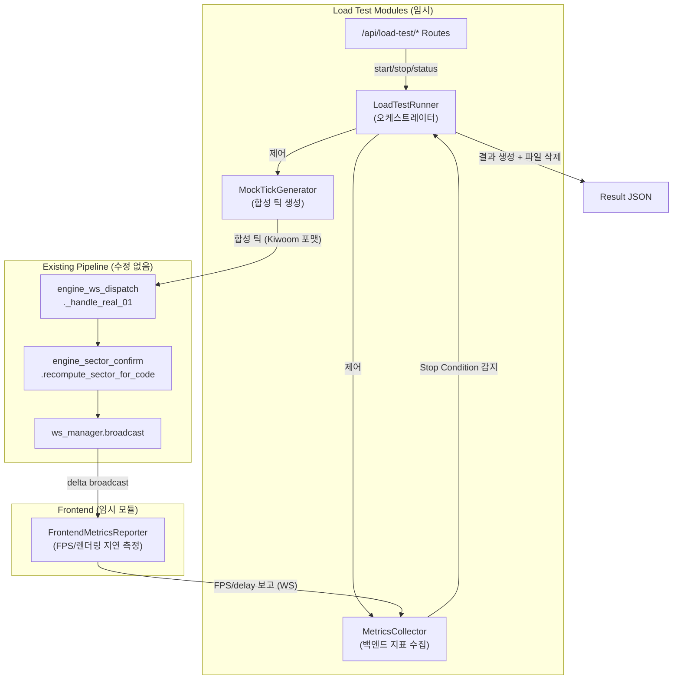

# Design Document: Load Test Pipeline

## Overview

SectorFlow 실시간 파이프라인의 최대 처리량 한계를 측정하는 임시 로드 테스트 도구. 실제 증권사 WebSocket 없이 합성 틱을 기존 처리 경로(`engine_ws_dispatch._handle_real_01` → `engine_sector_confirm` → `ws_manager.broadcast`)에 직접 주입하여 단계별 부하를 증가시키며 성능 지표를 수집한다.

**핵심 설계 원칙:**
- **기존 경로 재사용**: Mock 틱은 `_handle_real_01`과 동일한 데이터 포맷으로 주입하여 실제 부하와 동일한 경로를 측정
- **제로 오버헤드 계측**: 메트릭 수집은 틱 처리 경로 외부에서 수행 (타임스탬프 삽입만 경로 내)
- **자기 삭제**: 테스트 완료 후 모든 소스 파일 자동 삭제, 결과 JSON만 보존
- **완전 격리**: 자동매매 비활성화, 실제 브로커 연결 차단, 테스트 전용 종목코드 사용

## Architecture



### 틱 주입 메커니즘

Mock 틱은 asyncio 이벤트 루프의 `call_later`를 사용하여 균일 간격으로 스케줄링된다. 각 틱은 `_handle_real_01`이 기대하는 정확한 dict 구조로 생성되어 직접 호출된다:

```python
# 주입 경로 (동기 직접 호출 — create_task 없음)
engine_ws_dispatch._handle_real_01(item, vals, "0B", True, es_module)
```

이 방식은 실제 Kiwoom WS 수신 경로와 동일한 동기 처리를 보장한다.

### 메트릭 수집 전략

틱 처리 경로에 오버헤드를 추가하지 않기 위해:
1. **주입 시점 타임스탬프**: `vals` dict에 `"_lt_ts"` 키로 `time.perf_counter_ns()` 삽입 (기존 FID 파싱에 영향 없음 — 미사용 키는 무시됨)
2. **프론트엔드 측정**: WS 메시지 수신 시 `_lt_ts` 추출 → `performance.now()` 비교로 end-to-end 지연 계산
3. **백엔드 CPU/메모리**: 별도 1초 주기 `call_later` 콜백에서 `psutil` 사용 (틱 경로 외부)

## Components and Interfaces

### 1. MockTickGenerator

```python
class MockTickGenerator:
    """합성 틱 데이터 생성기 — per-stock 상태 유지, bounded random walk."""

    def __init__(self, stock_codes: list[str], volatility_pct: float = 2.0):
        """
        Args:
            stock_codes: 테스트 종목코드 리스트 (T000001~T000050 형태)
            volatility_pct: 틱 간 최대 가격 변동률 (%)
        """
        ...

    def generate_tick(self) -> tuple[dict, dict, str]:
        """단일 틱 생성 → (item, vals, stock_code) 반환.

        Returns:
            item: {"item": "T000001_AL", "type": "0B", "values": {...}}
            vals: {"10": price, "11": change, "12": rate, "14": amount, "228": strength, "_lt_ts": ns}
            stock_code: 정규화된 종목코드
        """
        ...

    def reset(self) -> None:
        """모든 per-stock 상태 초기화."""
        ...
```

**종목코드 규칙**: `T` 접두사 + 6자리 숫자 (예: `T000001` ~ `T000050`). 기존 실제 종목코드(6자리 숫자)와 절대 충돌하지 않음.

### 2. LoadTestRunner

```python
class LoadTestRunner:
    """부하 테스트 오케스트레이터 — 단계 실행, 정지 조건 감시, 결과 생성."""

    STEPS: list[int] = [100, 200, 500, 1000, 2000, 5000, 10000]
    STEP_DURATION_SEC: int = 30
    STEP_PAUSE_SEC: int = 5

    async def start(self) -> None:
        """테스트 시작 — 격리 설정 → 베이스라인 측정 → 단계 순차 실행."""
        ...

    async def stop(self) -> None:
        """즉시 중단 — 현재 단계 종료 → 결과 생성 → 정리."""
        ...

    def get_status(self) -> dict:
        """현재 상태 스냅샷 반환."""
        ...
```

**단계 실행 흐름:**
1. 격리 설정 (자동매매 OFF, 브로커 연결 확인)
2. 베이스라인 측정 (CPU idle, RSS baseline)
3. 각 Step에 대해:
   - `call_later` 체인으로 균일 간격 틱 주입 스케줄링
   - 30초 동안 유지
   - 5초 대기 (시스템 안정화)
4. 결과 생성 → 정리 → 파일 삭제

**균일 분배 알고리즘:**
```python
interval_ns = 1_000_000_000 / ticks_per_sec  # 나노초 단위 간격
# asyncio.get_running_loop().call_later(interval_ns / 1e9, inject_next_tick)
```

### 3. MetricsCollector

```python
class MetricsCollector:
    """성능 지표 수집 + Stop Condition 평가."""

    def __init__(self, baseline_cpu: float, baseline_rss: int):
        ...

    def record_tick_injected(self) -> None:
        """주입된 틱 카운트 증가."""
        ...

    def record_frontend_report(self, fps: float, rendered_count: int, avg_delay_ms: float) -> None:
        """프론트엔드 보고 수신 처리."""
        ...

    def evaluate_stop_conditions(self) -> tuple[bool, str]:
        """1초 주기 평가 → (should_stop, reason)."""
        ...

    def finalize_step(self, step_tps: int) -> dict:
        """현재 단계 메트릭 집계 → StepResult dict 반환."""
        ...
```

**Stop Condition 평가 (1초 주기 `call_later`):**
| 조건 | 임계값 | 윈도우 |
|------|--------|--------|
| CPU | > 90% | 즉시 |
| FPS | < 30 | 즉시 (프론트 보고 기준) |
| WS 연결 끊김 | — | 즉시 |
| 메모리 증가 | > 500 MB | 60초 슬라이딩 윈도우 |
| 처리 지연 | > 100 ms 평균 | 5초 슬라이딩 윈도우 |

### 4. FrontendMetricsReporter (TypeScript)

```typescript
class LoadTestMetricsReporter {
  private active: boolean = false
  private frameCount: number = 0
  private lastFrameTime: number = 0
  private tickDelays: number[] = []
  private renderedCount: number = 0

  start(): void { /* rAF 루프 시작, WS 리스너 등록 */ }
  stop(): void { /* rAF 루프 중단, 리스너 해제 */ }

  // 1초마다 WS로 백엔드에 보고
  private reportMetrics(): void {
    ws.send(JSON.stringify({
      type: "load-test-metrics",
      fps: this.frameCount,
      rendered_count: this.renderedCount,
      avg_delay_ms: avg(this.tickDelays),
    }))
  }

  // real-data 이벤트에서 _lt_ts 추출하여 지연 계산
  onTickReceived(vals: Record<string, string>): void {
    const injectTs = vals['_lt_ts']
    if (injectTs) {
      const delay = performance.now() - (Number(injectTs) / 1e6) // ns → ms
      this.tickDelays.push(delay)
      this.renderedCount++
    }
  }
}
```

**FPS 측정**: `requestAnimationFrame` 콜백 카운트를 1초 간격으로 집계.

**지연 측정**: 백엔드가 `vals["_lt_ts"]`에 삽입한 `perf_counter_ns` 값을 프론트엔드에서 `performance.now()`와 비교. 시계 동기화는 동일 머신이므로 불필요.

### 5. Load Test API Routes

```python
router = APIRouter(prefix="/api/load-test", tags=["load-test"])

@router.post("/start")
async def start_load_test() -> dict:
    """테스트 시작. 이미 실행 중이면 409."""
    ...

@router.post("/stop")
async def stop_load_test() -> dict:
    """즉시 중단 + 결과 생성."""
    ...

@router.get("/status")
async def get_load_test_status() -> dict:
    """현재 단계, 경과 시간, 최신 메트릭."""
    ...
```

### 6. Post-Test Cleanup

```python
class LoadTestCleanup:
    """테스트 완료 후 자기 삭제 + 파일 복원."""

    FILES_TO_DELETE: list[Path] = [
        Path("backend/app/services/load_test_runner.py"),
        Path("backend/app/services/mock_tick_generator.py"),
        Path("backend/app/services/load_test_metrics.py"),
        Path("backend/app/web/routes/load_test.py"),
        Path("frontend/src/utils/loadTestReporter.ts"),
    ]

    MODIFIED_FILES: dict[Path, str] = {}  # {path: original_content}

    def execute(self, result_path: Path) -> None:
        """결과 파일 존재 확인 → 수정 파일 복원 → 테스트 파일 삭제."""
        ...
```

**복원 대상**: `app.py`의 라우터 등록 라인, `binding.ts`의 메트릭 리포터 import.

## Data Models

### Tick Data Format (Kiwoom REAL 호환)

```python
# _handle_real_01이 기대하는 구조
item = {
    "item": "T000001_AL",  # 종목코드 + 거래소 접미사
    "type": "0B",
    "values": {
        "10": "50000",      # 현재가 (FID 10)
        "11": "500",        # 전일대비 (FID 11)
        "12": "1.01",       # 등락률 (FID 12)
        "13": "1000",       # 거래량 (FID 13)
        "14": "500",        # 누적거래대금 백만원 (FID 14)
        "228": "120.50",    # 체결강도 (FID 228)
        "25": "2",          # 대비부호 (FID 25): 2=상승
        "_lt_ts": "123456789012345",  # 주입 타임스탬프 (ns, 로드테스트 전용)
    },
}
vals = item["values"]
```

### StepResult

```python
@dataclass
class StepResult:
    step_tps: int           # 목표 ticks/sec
    avg_delay_ms: float     # 평균 처리 지연
    max_delay_ms: float     # 최대 처리 지연
    cpu_pct: float          # 평균 CPU 사용률
    fps: float              # 평균 FPS
    memory_mb: float        # 피크 메모리 증가량
    tick_loss_pct: float    # 틱 유실률
    status: str             # "ok" | "warning" | "stopped"
    stop_reason: str | None # 정지 사유 (status=="stopped"일 때)
    duration_sec: float     # 실제 실행 시간
```

### ResultReport

```python
@dataclass
class ResultReport:
    timestamp: str                  # ISO 8601
    steps: list[StepResult]
    comfortable_throughput: int     # 모든 지표 정상인 최대 tps
    limit_throughput: int           # Stop 직전 최대 tps
    first_bottleneck: str           # 첫 번째 병목 설명
    recommended_safe_limit: int     # comfortable * 0.7
    stop_reason: str | None         # 최종 정지 사유
    total_duration_sec: float       # 전체 테스트 시간
```

### Status Classification Thresholds

| 지표 | ✅ Normal | ⚠️ Warning | ❌ Stop |
|------|-----------|------------|---------|
| Delay (ms) | < 50 | 50–100 | > 100 (5s avg) |
| CPU (%) | < 70 | 70–90 | > 90 |
| FPS | > 55 | 30–55 | < 30 |
| Memory (MB) | < 200 | 200–500 | > 500 (60s window) |
| Tick Loss (%) | < 1 | 1–5 | — |

## Correctness Properties

*A property is a characteristic or behavior that should hold true across all valid executions of a system—essentially, a formal statement about what the system should do. Properties serve as the bridge between human-readable specifications and machine-verifiable correctness guarantees.*

### Property 1: Tick Format Validity

*For any* generated tick from MockTickGenerator, the output `(item, vals)` SHALL conform to the Kiwoom REAL 0B message schema: `item` contains `"item"` (string with `_AL` suffix), `"type"` = `"0B"`, and `vals` contains keys `"10"` (positive integer string), `"11"` (integer string), `"12"` (float string), `"14"` (non-negative integer string), `"228"` (float string), `"25"` (sign string), and `"_lt_ts"` (nanosecond timestamp string).

**Validates: Requirements 1.1, 1.4**

### Property 2: Sequential Tick Coherence

*For any* sequence of ticks generated for the same stock code, (a) the absolute price change between consecutive ticks SHALL NOT exceed `volatility_pct` of the previous price, and (b) the cumulative trade amount (FID 14) SHALL be monotonically non-decreasing.

**Validates: Requirements 1.2, 1.5**

### Property 3: Tick Distribution Coverage

*For any* configured set of N stock codes (N ≥ 20) and any batch of N×10 generated ticks, every configured stock code SHALL appear at least once in the batch.

**Validates: Requirements 1.3**

### Property 4: Uniform Injection Timing

*For any* target tick rate R (ticks/sec), the scheduled injection timestamps within a 1-second interval SHALL have a coefficient of variation (std_dev / mean_interval) below 0.1, ensuring uniform distribution without burst patterns.

**Validates: Requirements 2.4**

### Property 5: Sliding Window Stop Condition Detection

*For any* sequence of metric readings where (a) memory delta exceeds 500 MB within a 60-second window, or (b) average processing time exceeds 100 ms over a 5-second window, the `evaluate_stop_conditions()` function SHALL return `(True, reason)` with the correct stop reason.

**Validates: Requirements 3.5, 3.6**

### Property 6: Tick Loss Rate Calculation

*For any* pair of non-negative integers (injected_count, rendered_count) where rendered_count ≤ injected_count, the tick loss rate SHALL equal `(injected_count - rendered_count) / injected_count * 100` when injected_count > 0, and 0.0 when injected_count == 0.

**Validates: Requirements 4.5**

### Property 7: Step Metrics Aggregation

*For any* non-empty collection of per-tick delay measurements and per-second CPU/FPS/memory readings, `finalize_step()` SHALL produce: avg_delay = mean(delays), max_delay = max(delays), cpu_pct = mean(cpu_readings), fps = mean(fps_readings), memory_mb = max(memory_deltas).

**Validates: Requirements 4.6**

### Property 8: Status Classification

*For any* StepResult, the status SHALL be: `"ok"` if ALL metrics are within normal range (delay < 50, cpu < 70, fps > 55, memory < 200, loss < 1); `"warning"` if ANY metric is in warning range but no stop condition triggered; `"stopped"` if a stop condition was triggered during that step.

**Validates: Requirements 6.3, 6.4, 6.5**

### Property 9: Conclusions Derivation

*For any* ordered list of StepResults, `comfortable_throughput` SHALL equal the `step_tps` of the last step with status `"ok"` (0 if none), `limit_throughput` SHALL equal the `step_tps` of the last step before the first `"stopped"` step (or the last step if none stopped), and `recommended_safe_limit` SHALL equal `floor(comfortable_throughput * 0.7)`.

**Validates: Requirements 6.6**

### Property 10: Concurrent Start Rejection

*For any* number of POST `/api/load-test/start` requests received while a test is already running, ALL such requests SHALL receive HTTP 409 status code.

**Validates: Requirements 7.3**

### Property 11: Test Stock Code Distinguishability

*For any* tick generated by MockTickGenerator, the stock code SHALL start with the prefix `"T"` followed by exactly 6 digits, ensuring it never matches any real Korean stock code format (6 digits without prefix).

**Validates: Requirements 8.5**

### Property 12: Post-Test State Restoration

*For any* engine settings snapshot taken before the test starts, after the test completes (including cleanup), the engine settings SHALL be identical to the pre-test snapshot. Similarly, for any file whose content was recorded before modification, the file content SHALL match the recorded original after cleanup.

**Validates: Requirements 8.4, 9.4**

## Error Handling

### 틱 주입 실패
- `_handle_real_01` 내부 예외 발생 시: 해당 틱 스킵, 에러 카운트 증가, 로그 기록
- 에러율 > 10% 시: Stop Condition으로 처리

### 프론트엔드 보고 누락
- 3초 이상 프론트엔드 메트릭 미수신 시: WS 연결 끊김으로 간주 → Stop Condition
- 부분 데이터로도 결과 생성 가능 (FPS/delay는 "N/A"로 표시)

### 정리 실패
- 결과 JSON 쓰기 실패 시: 콘솔 출력으로 대체, 파일 삭제 진행하지 않음
- 개별 파일 삭제 실패 시: 에러 로그 + 실패 파일 목록 출력, 나머지 파일 삭제 계속
- 수정 파일 복원 실패 시: 원본 내용을 `.bak` 파일로 저장, 수동 복원 안내 로그

### SIGINT 처리
- `signal.signal(SIGINT, handler)` 등록
- 현재 틱 주입 즉시 중단
- 수집된 데이터로 부분 결과 생성
- 정리 수행 후 정상 종료 허용

## Testing Strategy

### Property-Based Tests (Hypothesis)

이 프로젝트는 이미 `hypothesis` 라이브러리를 사용 중이므로 동일하게 적용한다.

**구성:**
- 최소 100회 반복 (`@settings(max_examples=100)`)
- 각 테스트에 설계 문서 Property 참조 태그 포함
- 태그 형식: `# Feature: load-test-pipeline, Property N: {title}`

**대상 Properties:**
1. Tick Format Validity — 랜덤 종목코드/가격 범위로 생성, 스키마 검증
2. Sequential Tick Coherence — 랜덤 시퀀스 길이/초기 가격으로 연속성 검증
3. Tick Distribution Coverage — 랜덤 종목 수(20~100)로 분배 검증
4. Uniform Injection Timing — 랜덤 tick rate(100~10000)로 균일성 검증
5. Sliding Window Stop Condition — 랜덤 메트릭 시퀀스로 감지 정확성 검증
6. Tick Loss Rate Calculation — 랜덤 (injected, rendered) 쌍으로 계산 검증
7. Step Metrics Aggregation — 랜덤 메트릭 컬렉션으로 집계 검증
8. Status Classification — 랜덤 메트릭 조합으로 분류 검증
9. Conclusions Derivation — 랜덤 StepResult 시퀀스로 결론 도출 검증
10. Test Stock Code Distinguishability — 랜덤 생성으로 접두사 검증
11. Post-Test State Restoration — 랜덤 설정 dict로 round-trip 검증

### Unit Tests (Example-Based)

- Stop Condition 개별 임계값 테스트 (CPU 90%, FPS 30, WS 끊김)
- API 엔드포인트 응답 코드 (200, 409)
- 격리 설정 (자동매매 비활성화 확인)
- 결과 JSON 파일 구조 검증
- 정리 실패 시 에러 로깅 확인

### Integration Tests

- 전체 2-step 미니 테스트 실행 (100, 200 tps × 2초)
- 프론트엔드 메트릭 보고 WS 메시지 수신 확인
- SIGINT 시 graceful shutdown 확인
- 파일 삭제 후 import 에러 없음 확인

### 테스트 파일 위치

```
backend/tests/test_load_test_properties.py   # Property-based tests
backend/tests/test_load_test_unit.py         # Unit tests
backend/tests/test_load_test_integration.py  # Integration tests
```
