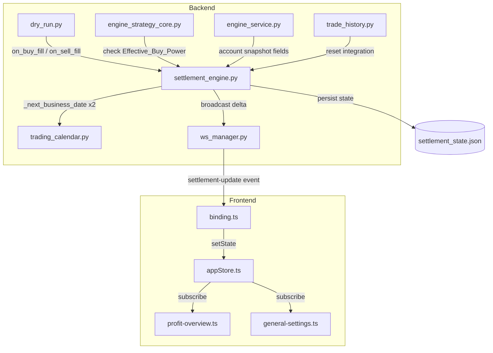

# Design Document: Test Mode Cash Settlement

## Overview

테스트모드에서 현실 증권시장의 현금 흐름(예수금 관리, 매도대금 D+2 인출 제한)을 시뮬레이션하는 Settlement Engine 모듈을 설계한다.

핵심 동작:
- **매수 시**: Available_Cash에서 주문금액 + 수수료(0.015%) 차감
- **매도 시**: 순매도대금(매도금액 - 세금 0.20% - 수수료 0.015%)을 Available_Cash에 즉시 추가하되, 동일 금액을 Pending_Withdrawal로 기록하여 인출 제한
- **D+2 정산**: Trading_Calendar 기반 2영업일 후 타이머 발화 시 Pending_Withdrawal 삭제 → 인출 가능 전환
- **모드 분리**: 테스트/실전 모드 각각 독립 상태 유지, 모드 전환 시 상태 저장/복원

기존 `dry_run.py`의 단순 예수금 차감/증가 로직을 대체하며, 이벤트 기반(call_later) 아키텍처를 유지한다.

## Architecture



### 설계 결정 사항

1. **새 모듈 `settlement_engine.py`**: `dry_run.py`의 예수금 로직을 분리하여 정산 전용 모듈로 독립. `dry_run.py`는 가상 체결(포지션 관리)에만 집중.
2. **이벤트 기반 타이머**: `asyncio.get_running_loop().call_later()`로 D+2 정산 스케줄링. 폴링 없음.
3. **파일 영속화**: `backend/data/settlement_state.json`에 상태 저장. 앱 재시작 시 복원.
4. **정수 연산**: 모든 금액은 원(₩) 단위 정수. 부동소수점 사용 금지.
5. **기존 인터페이스 유지**: `dry_run.py`의 `get_virtual_balance()`, `_deduct_virtual_balance()`, `_add_virtual_balance()` 호출을 Settlement Engine으로 위임.

## Components and Interfaces

### 1. SettlementEngine (backend/app/services/settlement_engine.py)

```python
class PendingWithdrawal:
    """미정산 매도대금 항목."""
    sell_date: str          # 매도일 (YYYY-MM-DD)
    stk_cd: str             # 종목코드
    stk_nm: str             # 종목명
    amount: int             # 순매도대금 (원)
    settlement_date: str    # 정산일 (YYYY-MM-DD)

# ── 모듈 레벨 상태 ──
_available_cash: int                    # 매수 가능 금액
_pending_withdrawals: list[PendingWithdrawal]  # 미정산 목록
_timer_handles: list[asyncio.TimerHandle]      # 활성 타이머
_loaded: bool                           # 파일 로드 완료 여부

# ── 공개 API ──
def init(initial_deposit: int) -> None
def get_available_cash() -> int
def get_withdrawable_cash() -> int
def get_pending_withdrawal_total() -> int
def get_pending_withdrawals() -> list[dict]

def check_buy_power(order_amount: int) -> tuple[bool, str]
def on_buy_fill(price: int, qty: int) -> int          # 차감 후 잔액 반환
def on_sell_fill(price: int, qty: int, stk_cd: str, stk_nm: str) -> int  # 추가 후 잔액 반환
def charge(amount: int) -> int                         # 충전 후 잔액 반환
def withdraw(amount: int) -> tuple[bool, int]          # (성공여부, 잔액)

def reset(initial_deposit: int) -> None                # 전체 초기화
def save_state() -> None                               # 모드 전환 시 상태 저장
def restore_state() -> None                            # 모드 전환 시 상태 복원
def get_effective_buy_power(daily_limit: int, daily_spent: int) -> int

def _schedule_settlement(pw: PendingWithdrawal) -> None
def _settle(pw: PendingWithdrawal) -> None
def _calc_settlement_date(sell_date: date) -> date
def _seconds_until_settlement(settlement_date: date) -> float
def _persist() -> None
def _load() -> None
def _broadcast_delta() -> None
```

### 2. dry_run.py 변경

기존 `_deduct_virtual_balance()` / `_add_virtual_balance()` 호출을 제거하고, Settlement Engine의 `on_buy_fill()` / `on_sell_fill()`로 위임:

```python
# 변경 전
def _apply_buy(code, qty, price):
    cost = price * qty
    fee = round(cost * 0.00015)
    _deduct_virtual_balance(cost + fee)
    ...

# 변경 후
def _apply_buy(code, qty, price):
    from app.services.settlement_engine import on_buy_fill
    on_buy_fill(price, qty)  # 내부에서 수수료 계산 + 차감
    ...
```

### 3. engine_strategy_core.py 변경

매수 전 `check_buy_power()` 호출 추가:

```python
from app.services.settlement_engine import get_effective_buy_power

def _can_buy(settings, order_amount):
    daily_limit = int(settings.get("max_daily_total_buy_amt", 0))
    daily_spent = _auto_trade._daily_buy_spent if _auto_trade else 0
    effective = get_effective_buy_power(daily_limit, daily_spent)
    return order_amount <= effective
```

### 4. engine_service.py 변경

`get_account_snapshot()` 및 `_refresh_account_snapshot_meta()`에서 테스트모드일 때 Settlement Engine 필드 포함:

```python
if _is_test:
    from app.services import settlement_engine as se
    snap["deposit"] = se.get_available_cash()
    snap["withdrawable"] = se.get_withdrawable_cash()
    snap["pending_withdrawal"] = se.get_pending_withdrawal_total()
```

### 5. Frontend 변경

**appStore.ts**: `account` 타입에 `withdrawable`, `pending_withdrawal` 필드 추가 (이미 optional로 존재).

**profit-overview.ts**: 테스트모드일 때 계좌 현황 영역에서 "예수금" 대신 3개 항목 표시:
- 매수 가능 (deposit)
- 인출 가능 (withdrawable)  
- 정산 대기 (pending_withdrawal)

**binding.ts**: `settlement-update` 이벤트 핸들러 추가 (account-update 이벤트에 포함되므로 별도 이벤트 불필요).

## Data Models

### settlement_state.json (backend/data/)

```json
{
  "available_cash": 10000000,
  "pending_withdrawals": [
    {
      "sell_date": "2026-05-06",
      "stk_cd": "005930",
      "stk_nm": "삼성전자",
      "amount": 7134627,
      "settlement_date": "2026-05-08"
    }
  ],
  "initial_deposit": 10000000
}
```

### AccountSnapshot 확장 필드

| 필드 | 타입 | 설명 |
|------|------|------|
| `deposit` | int | 매수 가능 금액 (= Available_Cash) |
| `withdrawable` | int | 인출 가능 금액 (= Available_Cash - Pending_Withdrawal 합계) |
| `pending_withdrawal` | int | 정산 대기 금액 (= Pending_Withdrawal 합계) |

### 수수료/세금 상수

| 항목 | 비율 | 적용 시점 |
|------|------|-----------|
| Buy_Commission | 0.00015 (0.015%) | 매수 체결 시 |
| Sell_Commission | 0.00015 (0.015%) | 매도 체결 시 |
| Securities_Transaction_Tax | 0.002 (0.20%) | 매도 체결 시 |

### 계산 공식

```
매수 비용 = price × qty + round(price × qty × 0.00015)
순매도대금 = price × qty - round(price × qty × 0.002) - round(price × qty × 0.00015)
Effective_Buy_Power = min(Available_Cash, max(0, Daily_Buy_Limit - daily_spent))
                      (Daily_Buy_Limit == 0이면 Available_Cash만 사용)
Withdrawable_Cash = Available_Cash - sum(pw.amount for pw in pending_withdrawals)
```

## Correctness Properties

*A property is a characteristic or behavior that should hold true across all valid executions of a system — essentially, a formal statement about what the system should do. Properties serve as the bridge between human-readable specifications and machine-verifiable correctness guarantees.*

### Property 1: Buy fill deduction is exact and preserves non-negativity

*For any* valid initial Available_Cash and any (price, qty) pair where the total cost (price×qty + commission) does not exceed Available_Cash, calling `on_buy_fill(price, qty)` SHALL reduce Available_Cash by exactly `price×qty + round(price×qty×0.00015)`, and Available_Cash SHALL remain a non-negative integer after the operation.

**Validates: Requirements 1.2, 1.4**

### Property 2: Buy power check correctly enforces effective limit

*For any* (available_cash, daily_limit, daily_spent, order_amount) tuple, `check_buy_power(order_amount)` SHALL return `(False, reason)` if and only if `order_amount + round(order_amount×0.00015) > min(available_cash, max(0, daily_limit - daily_spent))` (where daily_limit == 0 means unlimited, using available_cash alone).

**Validates: Requirements 1.3, 3.1, 3.2, 3.3**

### Property 3: Sell fill adds correct net proceeds and creates matching pending withdrawal

*For any* (price, qty, stk_cd, stk_nm) sell fill, calling `on_sell_fill()` SHALL increase Available_Cash by exactly `price×qty - round(price×qty×0.002) - round(price×qty×0.00015)`, AND SHALL create a Pending_Withdrawal entry with `amount` equal to that same net proceeds value and `settlement_date` equal to D+2 business days from the sell date.

**Validates: Requirements 2.1, 2.2, 2.5**

### Property 4: Withdrawable cash invariant

*For any* state of the Settlement Engine, `get_withdrawable_cash()` SHALL always equal `get_available_cash() - sum(pw.amount for pw in get_pending_withdrawals())`.

**Validates: Requirements 2.3**

### Property 5: Settlement removes pending withdrawal and increases withdrawable cash

*For any* Pending_Withdrawal entry in the list, calling `_settle(pw)` SHALL remove that entry from the pending list, and `get_withdrawable_cash()` SHALL increase by exactly `pw.amount` while `get_available_cash()` remains unchanged.

**Validates: Requirements 2.4**

### Property 6: D+2 settlement date skips non-business days

*For any* date, `_calc_settlement_date(date)` SHALL return a date that is exactly 2 business days ahead, where the result is never a Saturday, Sunday, Korean public holiday, or Workers' Day (May 1st).

**Validates: Requirements 4.1, 4.2**

### Property 7: State persistence round-trip with expired entry cleanup

*For any* settlement state (available_cash, list of pending_withdrawals with various settlement_dates), persisting to file and then loading SHALL restore `available_cash` exactly, preserve all entries whose `settlement_date` is in the future, and remove all entries whose `settlement_date` has already passed.

**Validates: Requirements 2.7, 7.3**

### Property 8: Reset restores initial state completely

*For any* settlement state (arbitrary available_cash, non-empty pending_withdrawals), calling `reset(initial_deposit)` SHALL result in `get_available_cash() == initial_deposit` AND `get_pending_withdrawals() == []`.

**Validates: Requirements 5.1, 5.2**

### Property 9: Charge increases Available_Cash by exact amount

*For any* positive integer charge amount, calling `charge(amount)` SHALL increase `get_available_cash()` by exactly `amount`.

**Validates: Requirements 1.6, 8.1**

### Property 10: Withdrawal bounded by withdrawable cash

*For any* state and withdrawal amount, `withdraw(amount)` SHALL succeed (returning True and reducing Available_Cash by `amount`) if and only if `amount <= get_withdrawable_cash()`. If `amount > get_withdrawable_cash()`, it SHALL return (False, unchanged_balance).

**Validates: Requirements 8.3, 8.4**

### Property 11: Mode isolation — test operations do not affect saved real state

*For any* sequence of test-mode operations (buy, sell, charge, withdraw) performed after saving state, calling `restore_state()` SHALL restore the previously saved Available_Cash and Pending_Withdrawal list (minus expired entries), unaffected by the intervening operations.

**Validates: Requirements 7.2, 7.3, 7.5**

## Error Handling

| 상황 | 처리 방식 |
|------|-----------|
| 예수금 부족으로 매수 거부 | `check_buy_power()` → `(False, "예수금 부족")` 반환, 로그 기록, 매수 진행 안 함 |
| 인출 가능 금액 초과 | `withdraw()` → `(False, current_balance)` 반환, "인출 가능 금액 초과" 사유 |
| 정산 파일 로드 실패 | 초기 예수금으로 새 상태 생성, 경고 로그 기록 |
| 정산 파일 저장 실패 | 경고 로그 기록, 인메모리 상태는 유지 (다음 저장 시 재시도) |
| 타이머 스케줄링 시 이벤트 루프 없음 | `RuntimeError` catch → 앱 재시작 시 `_load()`에서 만료 항목 즉시 정산 |
| 음수 금액 입력 | 충전/인출 시 `amount <= 0`이면 무시 (no-op) |
| 실전모드에서 Settlement Engine 호출 | 모든 공개 API가 실전모드 체크 후 no-op 또는 실전 잔고 반환 |
| 동시 호출 (race condition) | 단일 asyncio 이벤트 루프 → 동시성 문제 없음 (GIL + 단일 스레드) |

## Testing Strategy

### Property-Based Tests (pytest + Hypothesis)

- **라이브러리**: `hypothesis` (Python PBT 표준)
- **최소 반복**: 각 프로퍼티 테스트 100회 이상 (`@settings(max_examples=100)`)
- **태그 형식**: `# Feature: test-mode-cash-settlement, Property {N}: {title}`
- 각 Correctness Property(1~11)에 대해 1개의 property-based test 구현
- 생성기(strategy): 금액은 `st.integers(min_value=1, max_value=100_000_000)`, 수량은 `st.integers(min_value=1, max_value=10000)`, 날짜는 `st.dates(min_value=date(2024,1,1), max_value=date(2030,12,31))`

### Unit Tests (pytest)

- 특정 시나리오 검증:
  - 금요일 매도 → 정산일이 화요일인지 확인
  - 공휴일 전날 매도 → 정산일이 공휴일 이후인지 확인
  - 근로자의 날(5/1) 포함 D+2 계산
  - 모드 전환 시 상태 저장/복원 시나리오
  - 초기화 후 모든 상태가 깨끗한지 확인
- 통합 테스트:
  - `dry_run.py` → `settlement_engine.py` 연동
  - `engine_service.py` 계좌 스냅샷에 정산 필드 포함 확인
  - WS 브로드캐스트 호출 확인 (mock)

### Test File Structure

```
backend/tests/
├── test_settlement_engine.py          # Unit tests
├── test_settlement_properties.py      # Property-based tests (11 properties)
└── test_settlement_integration.py     # Integration tests
```

