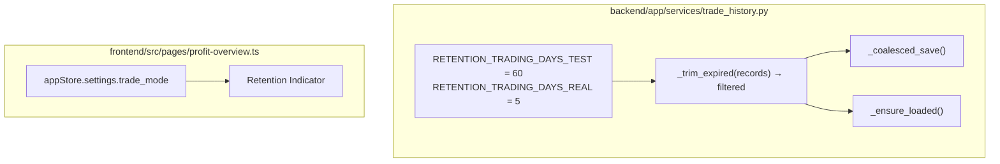

# Design Document: Trade History Retention

## Overview

이 기능은 `trade_history.json` 파일의 무한 증가를 방지하기 위해 모드별 보관 기한을 적용하는 자동 트림 메커니즘을 구현한다.

- **테스트모드**: 최근 60거래일 보관
- **실전모드**: 최근 5거래일 보관 (MTS/HTS에서 전체 이력 조회 가능하므로 짧게 유지)

트림은 두 시점에 실행된다:
1. **저장 시** — `_coalesced_save()` 내에서 파일 기록 직전에 적용
2. **로드 시** — `_ensure_loaded()` 내에서 파일 읽기 직후에 적용

프론트엔드에서는 수익현황 페이지의 요약 카드 영역에 현재 모드에 맞는 보관 범위 라벨을 인라인 `<span>`으로 표시한다.

## Architecture



**설계 결정:**
- 트림 로직을 별도 함수 `_trim_expired()`로 분리하여 저장/로드 양쪽에서 재사용
- 외부 캘린더 함수 없이, 저장된 레코드 자체의 고유 날짜를 기준으로 cutoff 계산 — 거래는 영업일에만 발생하므로 저장된 날짜가 자연스럽게 영업일
- 기존 `_coalesced_save()` 패턴(threading lock + asyncio executor)을 유지하면서 shallow copy 단계에서 트림 적용
- 프론트엔드 라벨은 기존 `appStore.subscribe()` 콜백 내에서 `trade_mode` 변경 감지 시 텍스트 갱신

## Components and Interfaces

### Backend: `trade_history.py` 변경사항

#### 새 상수

```python
RETENTION_TRADING_DAYS_TEST: int = 60
RETENTION_TRADING_DAYS_REAL: int = 5
```

#### 새 함수: `_trim_expired`

```python
def _trim_expired(records: list[dict]) -> list[dict]:
    """보관 기한 초과 레코드 제거. 모드별 독립 적용.
    
    저장된 레코드 자체의 고유 날짜를 기준으로 cutoff를 계산한다.
    외부 캘린더 함수를 사용하지 않는다.
    
    Args:
        records: 매수 또는 매도 이력 리스트
        
    Returns:
        보관 기한 내 레코드만 포함된 새 리스트 (원본 불변)
    """
```

**동작:**
1. 각 레코드에서 `trade_mode` 확인 (없으면 `"test"`로 간주)
2. 모드별로 고유 `date` 값을 수집:
   - `trade_mode == "test"` (또는 누락): 해당 레코드들의 고유 date 수집
   - `trade_mode == "real"`: 해당 레코드들의 고유 date 수집
3. 각 모드의 고유 날짜를 내림차순 정렬 (최신 먼저)
4. 모드별 최근 N개 날짜만 유지:
   - test 모드: 최근 60개 고유 날짜
   - real 모드: 최근 5개 고유 날짜
5. 각 레코드에 대해:
   - `date` 필드가 없거나 유효하지 않으면 → 제거
   - 해당 레코드의 모드에서 retained date set에 포함되면 → 보존
   - 그 외 → 제거
6. 해당 모드에 레코드가 전혀 없으면 (빈 date set) → 해당 모드 레코드 삭제 없음
7. 원래 순서 유지

#### 수정: `_coalesced_save()`

```python
def _coalesced_save() -> None:
    # 기존 로직 유지, shallow copy 단계에서 트림 적용
    while True:
        with _lock:
            if not _save_pending:
                break
            _save_pending = False
            buy_copy = _trim_expired(list(_buy_history))
            sell_copy = _trim_expired(list(_sell_history))
            # 인메모리도 트림 결과로 교체
            _buy_history[:] = buy_copy
            _sell_history[:] = sell_copy
        _save_to_file(buy_data=buy_copy, sell_data=sell_copy)
```

#### 수정: `_ensure_loaded()`

```python
def _ensure_loaded() -> None:
    global _loaded
    if _loaded:
        return
    _load_from_file()
    _patch_sell_history()
    # 로드 후 트림 적용 — _schedule_save()를 통해 기존 coalesced save 경로 사용
    global _buy_history, _sell_history
    before_buy, before_sell = len(_buy_history), len(_sell_history)
    _buy_history = _trim_expired(_buy_history)
    _sell_history = _trim_expired(_sell_history)
    trimmed = (before_buy - len(_buy_history)) + (before_sell - len(_sell_history))
    if trimmed > 0:
        _schedule_save()  # 직접 _save_to_file() 호출 대신 coalesced save 메커니즘 사용
        logger.info("[체결이력] 로드 시 만료 레코드 %d건 정리", trimmed)
    _loaded = True
```

### Frontend: `profit-overview.ts` 변경사항

#### 새 요소: Retention Indicator

요약 카드 영역(`summaryRow`) 내에 인라인 `<span>` 추가:

```typescript
// summaryRow 생성 직후, 카드들 앞에 배치
const retentionLabel = document.createElement('span')
Object.assign(retentionLabel.style, {
  fontSize: '11px',
  color: '#999',
  alignSelf: 'center',
  whiteSpace: 'nowrap',
})
retentionLabel.textContent = isTestMode ? '최근 60거래일 데이터' : '최근 5거래일 데이터'
summaryRow.insertBefore(retentionLabel, summaryRow.firstChild)
```

#### 모드 전환 시 갱신

기존 `appStore.subscribe()` 콜백 내 `tradeModeChanged` 분기에서:

```typescript
if (tradeModeChanged) {
  // 기존 로직...
  retentionLabel.textContent = isTest ? '최근 60거래일 데이터' : '최근 5거래일 데이터'
}
```

## Data Models

### 기존 레코드 구조 (변경 없음)

```python
# 매수 레코드
{
    "ts": "2026-05-06T09:15:00",
    "date": "2026-05-06",        # ← 트림 기준 필드
    "time": "09:15:00",
    "side": "BUY",
    "stk_cd": "005930",
    "stk_nm": "삼성전자",
    "price": 70000,
    "qty": 100,
    "total_amt": 7001050,
    "fee": 1050,
    "reason": "...",
    "trade_mode": "test",        # ← 모드별 보관 기한 결정
}

# 매도 레코드 (추가 필드: avg_buy_price, buy_total_amt, realized_pnl, pnl_rate, tax)
```

### Cutoff 계산 로직

```python
# 저장된 레코드 자체의 고유 날짜를 기준으로 cutoff 계산
# 외부 캘린더 함수 불필요 — 거래는 영업일에만 발생하므로 저장된 날짜가 자연스럽게 영업일

def _compute_retained_dates(records: list[dict]) -> dict[str, set[str]]:
    """모드별 보관할 날짜 set 계산."""
    from collections import defaultdict
    
    # 모드별 고유 날짜 수집
    dates_by_mode: dict[str, set[str]] = defaultdict(set)
    for rec in records:
        date_val = rec.get("date", "")
        if not date_val:
            continue
        mode = rec.get("trade_mode", "test") or "test"
        dates_by_mode[mode].add(date_val)
    
    # 모드별 최근 N개 날짜만 유지
    retained: dict[str, set[str]] = {}
    for mode, dates in dates_by_mode.items():
        limit = RETENTION_TRADING_DAYS_TEST if mode == "test" else RETENTION_TRADING_DAYS_REAL
        sorted_dates = sorted(dates, reverse=True)[:limit]
        retained[mode] = set(sorted_dates)
    
    return retained
```

핵심 인사이트: 거래는 영업일에만 발생하므로, 저장된 레코드의 날짜가 곧 거래 활동이 있었던 영업일이다. 별도의 KRX 영업일 캘린더 조회 없이도 정확한 거래일 기반 보관이 가능하다.

## Correctness Properties

*A property is a characteristic or behavior that should hold true across all valid executions of a system — essentially, a formal statement about what the system should do. Properties serve as the bridge between human-readable specifications and machine-verifiable correctness guarantees.*

### Property 1: Mode-specific trim correctness

*For any* set of trade records with varying dates and trade modes, after the trim operation executes, the number of unique dates retained per mode SHALL NOT exceed the mode's limit (60 for test, 5 for real), all records whose date is among the most recent N unique dates for their mode SHALL be preserved, and all records whose date is NOT among the most recent N unique dates for their mode SHALL be removed.

**Validates: Requirements 1.3, 1.4, 2.1, 2.2, 2.3, 5.1, 5.2**

### Property 2: Mode isolation

*For any* mixed set of trade records containing both test-mode and real-mode entries, trimming SHALL process each mode independently — the set of real-mode records in the output SHALL be identical regardless of how many test-mode records exist (and vice versa), as long as the real-mode records' own dates are within their mode's top-5 unique dates.

**Validates: Requirements 2.6**

### Property 3: Chronological order invariant

*For any* chronologically ordered list of trade records, after the trim operation executes, the remaining records SHALL maintain their original relative order.

**Validates: Requirements 5.3**

### Property 4: Save-load round-trip

*For any* set of valid trade records with dates within their respective mode's retention window, saving to file then loading from file SHALL produce an equivalent set of records.

**Validates: Requirements 2.5, 5.5**

### Property 5: Trim on load removes expired records

*For any* JSON file containing trade records where a mode has more unique dates than its retention limit, loading the file SHALL result in those records with dates outside the most recent N unique dates being absent from the in-memory state, and the persisted file being updated to reflect the trimmed state.

**Validates: Requirements 3.1, 3.2**

## Error Handling

| 상황 | 처리 |
|------|------|
| `date` 필드 누락 또는 비정상 값 | 해당 레코드 제거 (Req 5.4) |
| `trade_mode` 필드 누락 | `"test"`로 간주하여 60개 고유 날짜 보관 적용 (레거시 데이터는 테스트모드로 간주) |
| 해당 모드에 레코드가 전혀 없음 | 트림 대상 없음 — 정상 동작 (빈 date set = 삭제 없음) |
| 파일 저장 실패 | 기존 `_save_to_file()` 예외 처리 유지 (경고 로그) |
| 빈 이력 파일 | 트림 대상 없음 — 정상 동작 |

## Testing Strategy

### Property-Based Tests (Hypothesis)

이 기능은 순수 함수(`_trim_expired`)를 중심으로 동작하며, 입력 공간(다양한 날짜, 모드 조합)이 넓으므로 property-based testing에 적합하다.

**라이브러리**: `hypothesis` (기존 프로젝트에서 사용 중)
**설정**: 각 property test 최소 100회 반복
**태그 형식**: `Feature: trade-history-retention, Property {N}: {title}`

**날짜 생성 전략:** 외부 캘린더 의존 없이 임의의 유효한 ISO 날짜 문자열을 생성한다. `_trim_expired`는 저장된 레코드의 고유 날짜만 사용하므로, 테스트에서는 어떤 유효한 날짜든 사용 가능하다.

```python
from hypothesis import strategies as st

# ✅ 임의의 유효한 ISO 날짜 생성 (KRX 영업일 제약 불필요)
valid_trade_date = st.dates(
    min_value=date(2024, 1, 1),
    max_value=date(2026, 12, 31),
).map(lambda d: d.isoformat())

# ✅ trade_mode 생성
valid_trade_mode = st.sampled_from(["test", "real"])
```

각 correctness property를 단일 hypothesis 테스트로 구현:
- Property 1: 다양한 날짜/모드 조합의 레코드 생성 → 트림 후 각 모드별 고유 날짜 수가 limit 이하인지 검증
- Property 2: 혼합 모드 레코드 생성 → 각 모드의 레코드가 독립적으로 처리되는지 검증
- Property 3: 정렬된 레코드 생성 → 트림 후 순서 유지 검증
- Property 4: 유효 레코드 생성 → save → load → 동등성 검증
- Property 5: 만료 레코드 포함 파일 생성 → load → 트림 결과 검증

### Unit Tests (Example-Based)

- 상수 값 확인 (RETENTION_TRADING_DAYS_TEST=60, RETENTION_TRADING_DAYS_REAL=5)
- 고유 날짜 61개인 test 레코드 → 트림 후 60개 날짜만 남는지 확인
- 고유 날짜 6개인 real 레코드 → 트림 후 5개 날짜만 남는지 확인
- 해당 모드에 레코드가 없으면 삭제 없음 확인
- `date` 필드 없는 레코드 제거 확인
- 프론트엔드 라벨 텍스트 확인 (모드별)

### Integration Tests

- 실제 `trade_history.json` 파일로 save→load 사이클 검증
- `_coalesced_save()` 호출 후 파일 내용 확인
- 엔진 기동 시 `_ensure_loaded()` 트림 동작 확인
